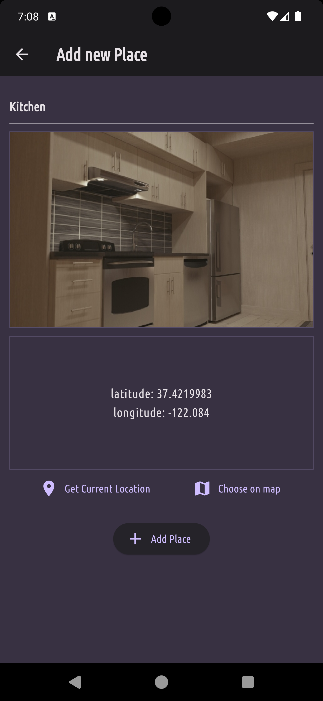
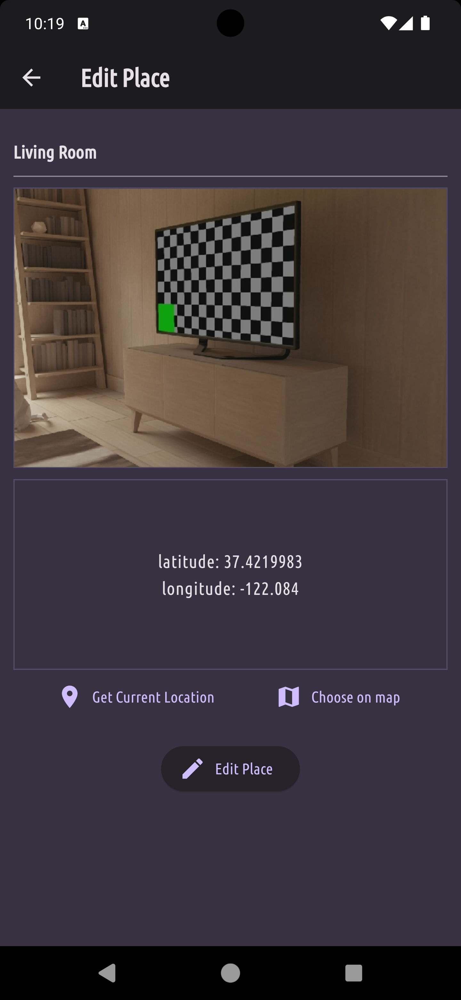

# Favourite Places

Favourite Places is a Flutter application that allows users to save their favorite places with a name, image, and coordinates. This README file provides an overview of the app, installation instructions, and features used.

## Screenshots

  
  
  
  

## Features
- Save your favorite places with a name, image, and coordinates.
- Use the mobile camera to take images.
- Fetch current location coordinates using GPS.
- Delete or Edit existing places.
- Store data locally using SQLite.

## Features Used
- SQFlite: Used for storing favorite places data locally in a SQLite database.
- Riverpod: Used for state management across the application.
- image_picker: Used to pick images from the gallery or camera.
- location: Used to fetch the device's current location coordinates.
- path: Used to manipulate file and directory paths.
